# 員工工安教育訓練報名系統 - 設計流程圖

## 📋 總覽

本文件描述系統的設計架構、元件關係、狀態管理與資料流。

---

## 🏗️ 系統架構

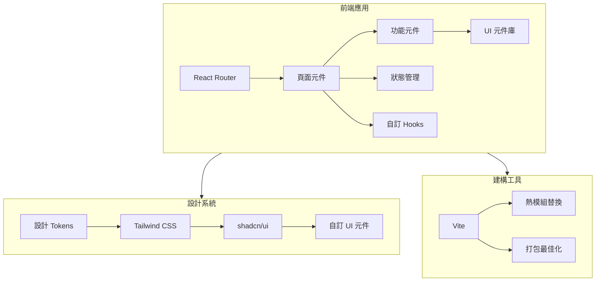

---

## 📁 專案結構設計

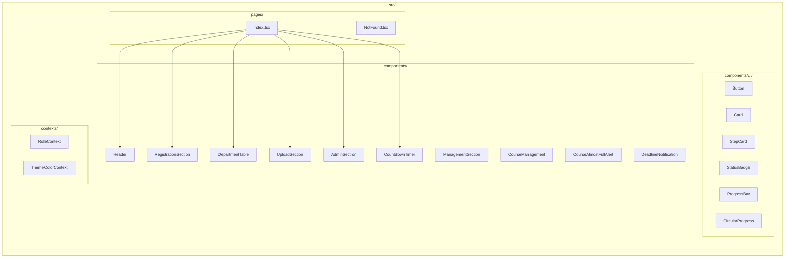

---

## 🎨 設計 Token 架構

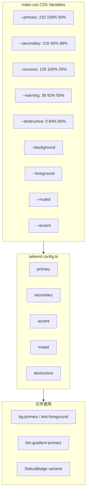

### 色彩對照

| Token | HSL 值 | 用途 |
|-------|--------|------|
| `--primary` | 210 100% 50% | 主品牌色、按鈕、連結 |
| `--secondary` | 210 40% 98% | 次要背景、卡片 |
| `--success` | 120 100% 25% | 成功狀態、已完成 |
| `--warning` | 38 92% 50% | 警告提示、即將截止 |
| `--destructive` | 0 84% 60% | 錯誤、刪除、駁回 |
| `--muted` | 210 40% 95% | 靜音文字、輔助資訊 |
| `--accent` | 210 40% 80% | 強調元素、主管標記 |

---

## 🔄 狀態管理設計

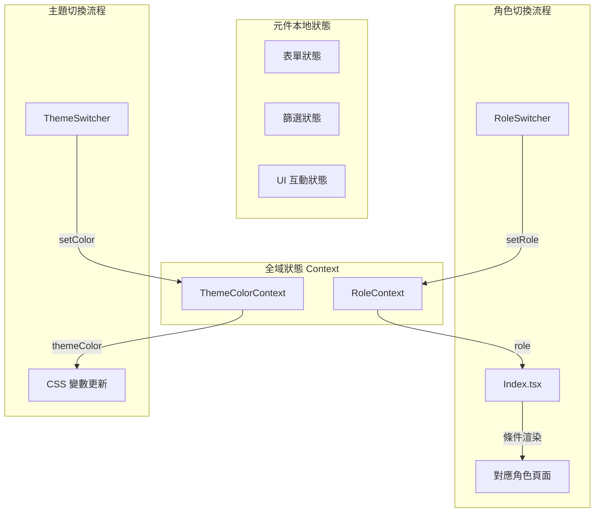

### 角色與頁面對應

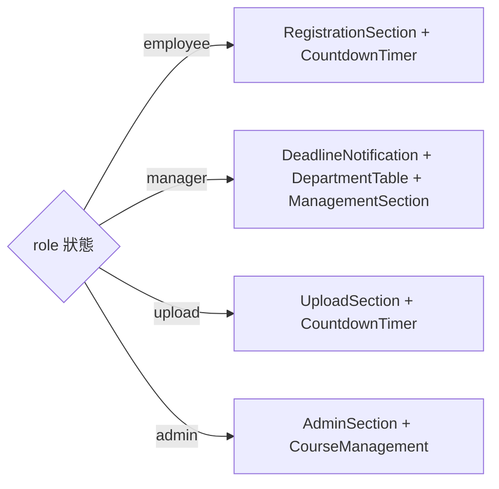

---

## 📦 元件設計規範

### 元件層級結構

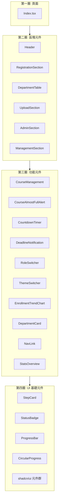

### 元件 Props 設計原則

| 原則 | 說明 | 範例 |
|------|------|------|
| 單一職責 | 每個元件只負責一個功能 | `CountdownTimer` 只處理倒數 |
| Props 最小化 | 只傳遞必要的資料 | `deadline: Date` |
| 語義化命名 | Props 名稱反映用途 | `onThresholdChange` |
| 預設值設定 | 提供合理預設值 | `threshold = 90` |

---

## 📐 佈局設計

### 響應式網格系統

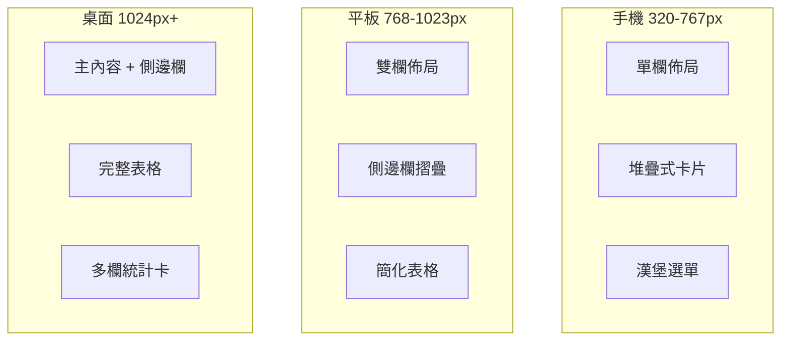

### 頁面佈局結構

```
+------------------------------------------+
|              Header (固定)                |
|  Logo | 導航連結 | 角色切換 | 主題切換     |
+------------------------------------------+
|                                          |
|  +----------------------------------+    |
|  |         主要內容區域              |    |
|  |                                  |    |
|  |  員工: 報名表單 + 倒數計時       |    |
|  |  主管: 統計表格 + 審核列表       |    |
|  |  上傳: 檔案管理 + 倒數計時       |    |
|  |  管理: 帳號管理 + 課程管理       |    |
|  |                                  |    |
|  +----------------------------------+    |
|                                          |
+------------------------------------------+
|              Footer (版權宣告)            |
+------------------------------------------+
```

---

## 📊 資料流設計

### 報名資料流

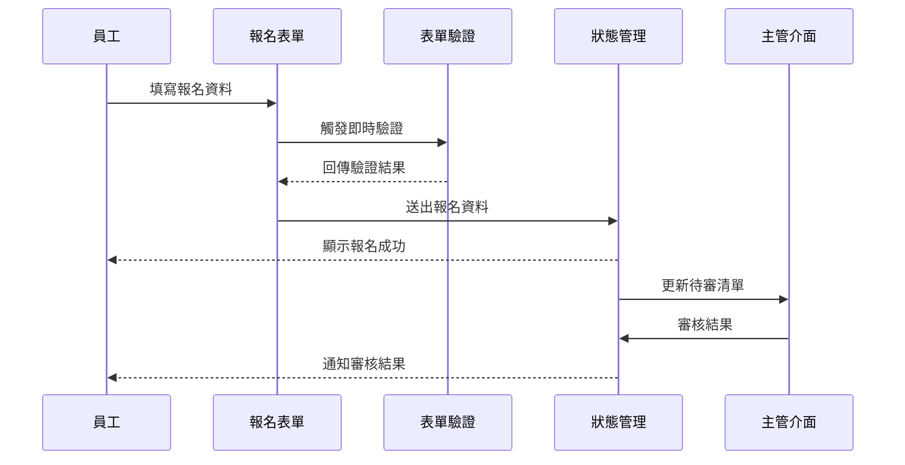

### 課程額滿通知流

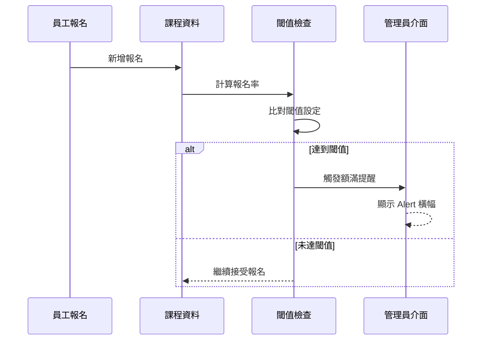

---

## 🧩 設計模式

### 1. 複合元件模式 (Compound Components)

```tsx
// StepCard 包裹內容
<StepCard step={1} title="報名資訊">
  <FormFields />
  <SubmitButton />
</StepCard>
```

### 2. 受控元件模式 (Controlled Components)

```tsx
// 父元件控制狀態
const [threshold, setThreshold] = useState(90);
<CourseAlmostFullAlert
  threshold={threshold}
  onThresholdChange={setThreshold}
/>
```

### 3. 條件渲染模式 (Conditional Rendering)

```tsx
// 根據角色渲染不同介面
{role === 'employee' && <RegistrationSection />}
{role === 'manager' && <DepartmentTable />}
{role === 'admin' && <AdminSection />}
```

---

## 🎯 效能最佳化策略

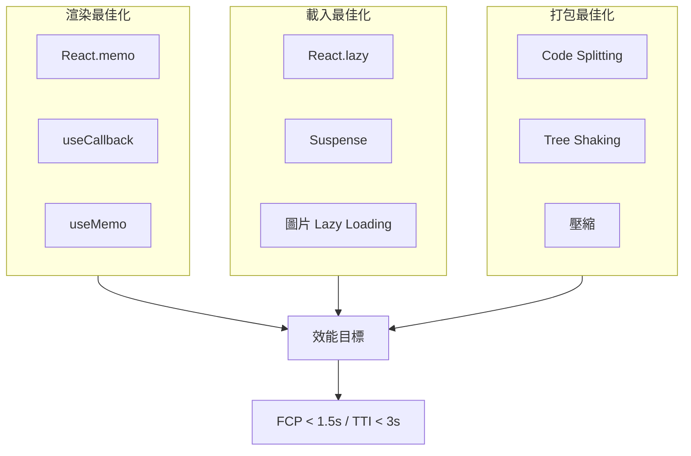

---

## 🔮 未來擴充設計

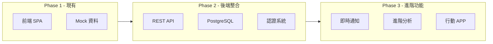

---

*文件版本：v1.0 ｜ 最後更新：2024-03-08*
