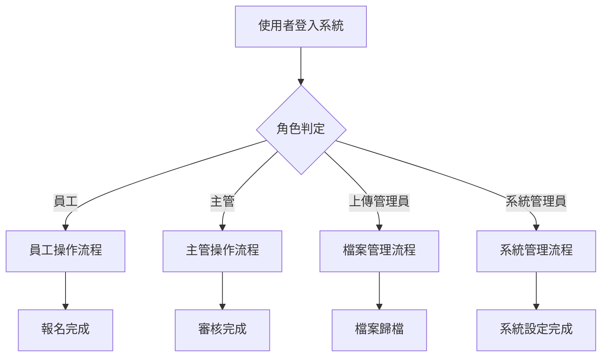
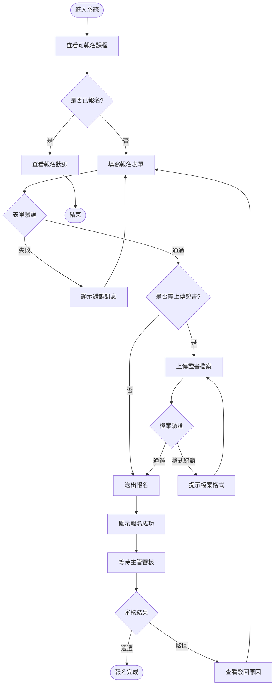
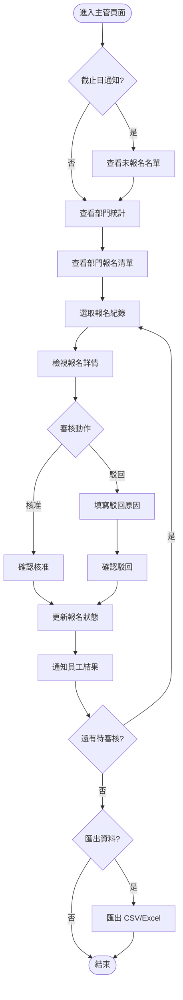
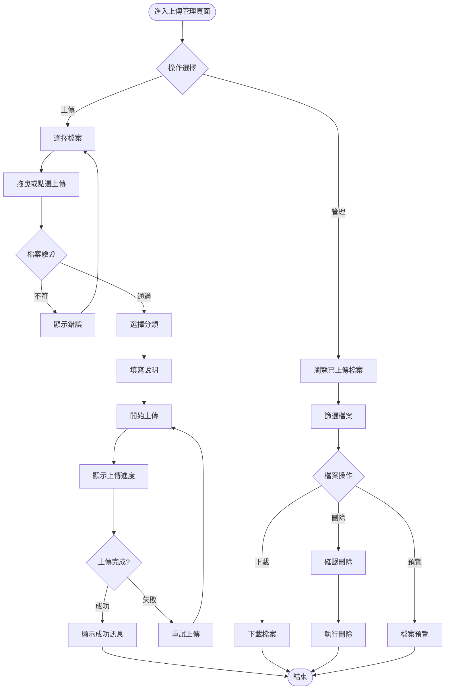
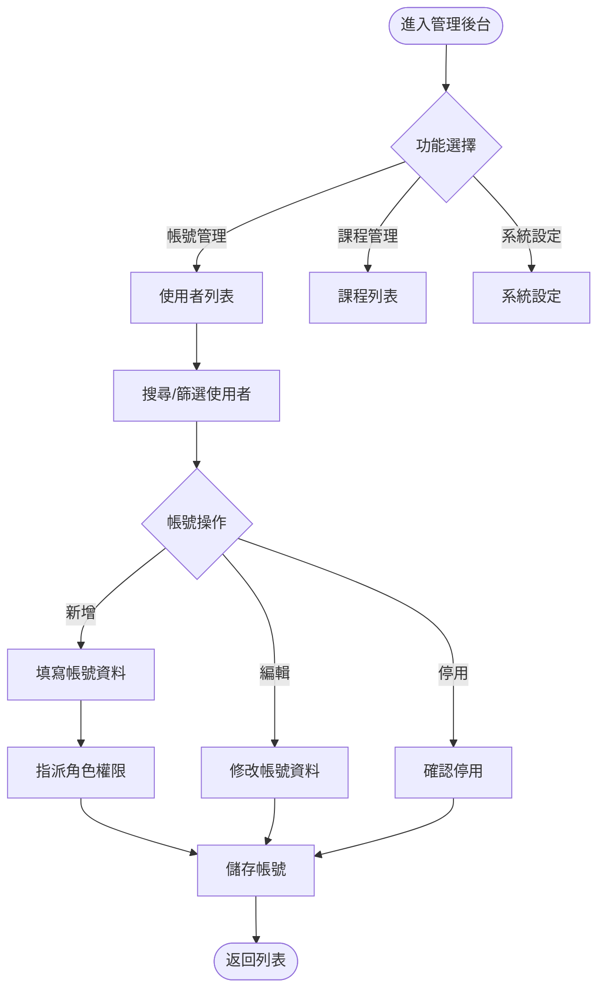
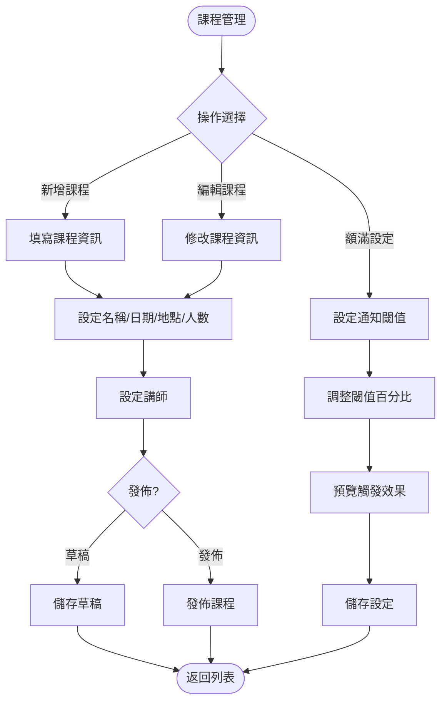
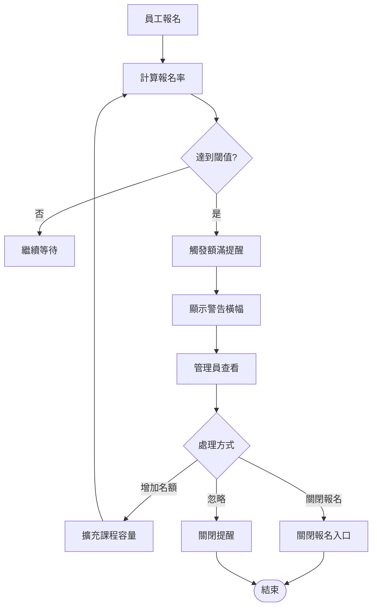
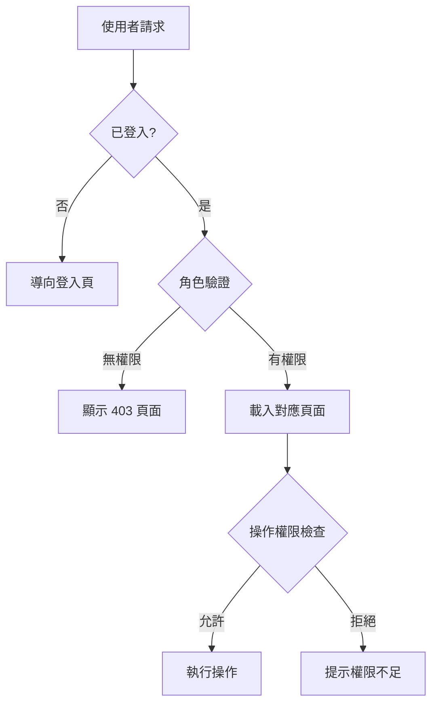
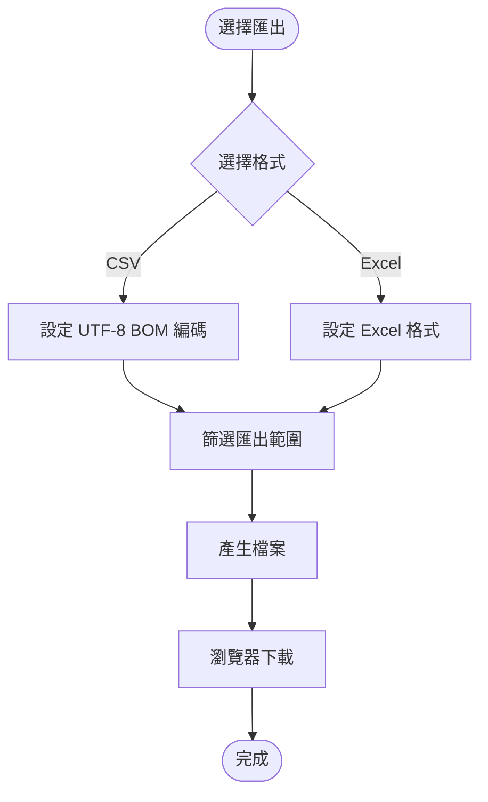

# 員工工安教育訓練報名系統 - 操作流程圖

## 📋 總覽

本文件描述系統各角色的操作流程與互動關係。

---

## 🔄 系統整體流程

---

## 👤 員工操作流程

### 1. 報名流程

### 2. 表單驗證規則

| 欄位 | 規則 | 錯誤提示 |
|------|------|----------|
| 姓名 | 必填，2-10 字元 | 請輸入有效姓名 |
| Email | 必填，有效格式 | 請輸入有效 Email |
| 電話 | 必填，手機格式 | 請輸入有效手機號碼 |
| 部門 | 必填，下拉選取 | 請選擇所屬部門 |
| 課程 | 必填，下拉選取 | 請選擇報名課程 |
| 檔案 | 選填，PDF/JPG/PNG，≤5MB | 檔案格式或大小不符 |

---

## 👔 主管操作流程

### 1. 審核流程

### 2. 截止日通知觸發條件

| 條件 | 動作 |
|------|------|
| 距截止日 ≤ 3 天 | 顯示黃色警告通知 |
| 距截止日 ≤ 1 天 | 顯示紅色緊急通知 |
| 部門未報名率 > 30% | 額外顯示未報名人員清單 |

---

## 📁 上傳管理員操作流程

### 1. 檔案管理流程

### 2. 支援檔案格式

| 類型 | 格式 | 大小限制 |
|------|------|----------|
| 文件 | PDF, DOC, DOCX | 10MB |
| 圖片 | JPG, PNG, GIF | 5MB |
| 壓縮檔 | ZIP, RAR | 50MB |

---

## ⚙️ 系統管理員操作流程

### 1. 帳號管理流程

### 2. 課程管理流程

### 3. 閾值通知流程

---

## 🔐 權限控制流程

### 權限對照表

| 功能 | 員工 | 主管 | 上傳管理員 | 系統管理員 |
|------|:----:|:----:|:----------:|:----------:|
| 個人報名 | ✅ | ❌ | ❌ | ❌ |
| 查看部門統計 | ❌ | ✅ | ❌ | ✅ |
| 審核報名 | ❌ | ✅ | ❌ | ✅ |
| 檔案上傳管理 | ❌ | ❌ | ✅ | ✅ |
| 帳號管理 | ❌ | ❌ | ❌ | ✅ |
| 課程管理 | ❌ | ❌ | ❌ | ✅ |
| 匯出資料 | ❌ | ✅ | ✅ | ✅ |
| 系統設定 | ❌ | ❌ | ❌ | ✅ |

---

## 📊 資料匯出流程

---

*文件版本：v1.0 ｜ 最後更新：2024-03-08*
